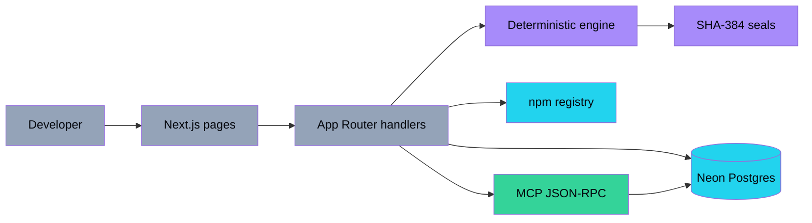
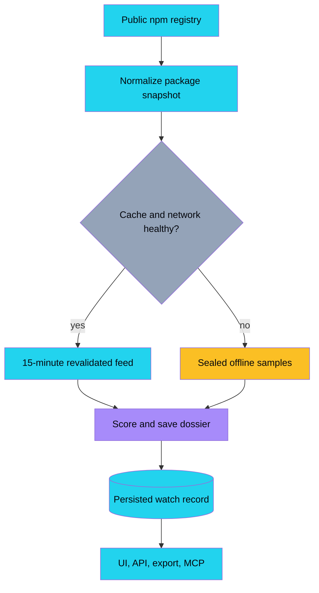
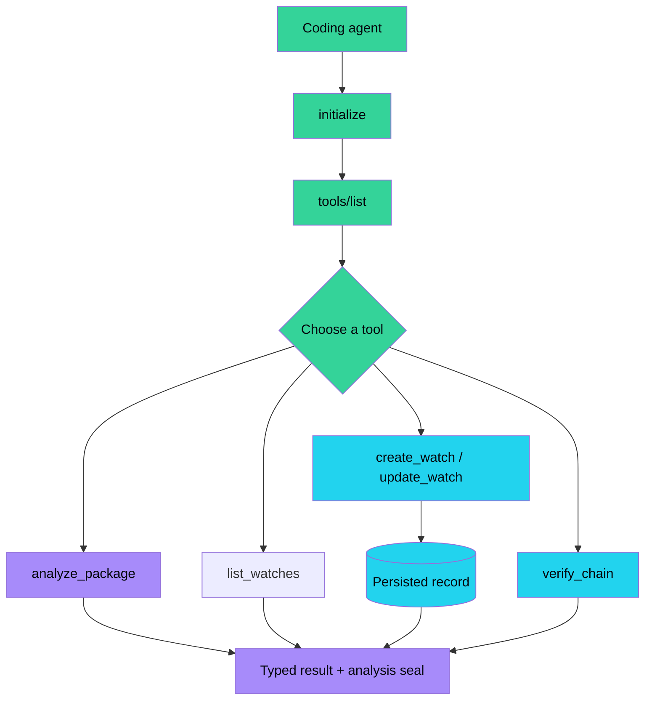
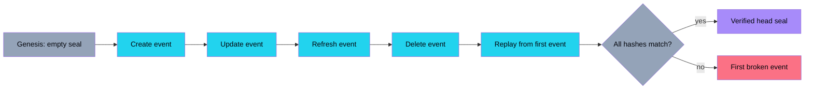
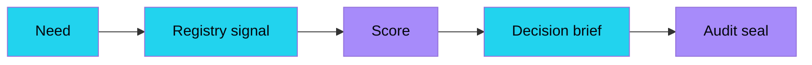
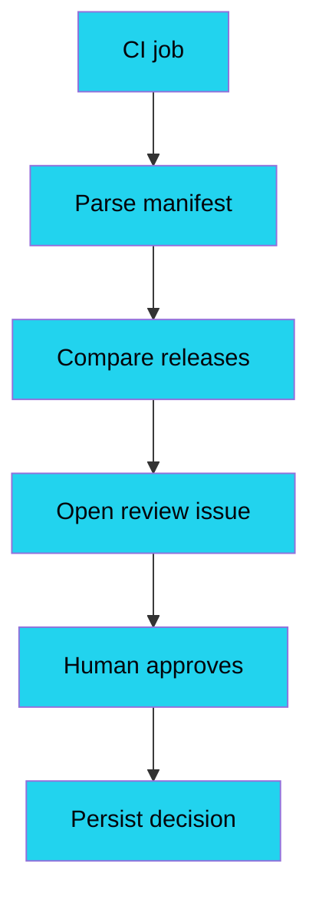
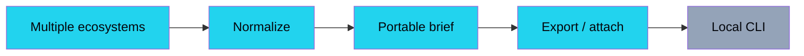

<div align="center">

# Upgrade Atelier

### Know what to upgrade before the upgrade knows you.

A keyless, explainable upgrade dossier for npm dependencies — live release signal, deterministic risk factors, migration notes, MCP tools, and replayable SHA-384 seals.

[Open the app](https://upgrade-atelier.vercel.app) · [Health API](https://upgrade-atelier.vercel.app/api/health) · [MCP endpoint](https://upgrade-atelier.vercel.app/api/mcp) · [Audit ledger](https://upgrade-atelier.vercel.app/audit) · [Issues](https://github.com/aniruddhaadak80/upgrade-atelier/issues)

[](https://upgrade-atelier.vercel.app)
[](LICENSE)
[](https://nextjs.org)
[](https://www.typescriptlang.org)
[](#-live-data)
[](#-agent-interface)

</div>

---

## ✨ Features

- **Decision-ready upgrade dossiers** — save an npm package, installed version, status, and review note in one place.
- **Explainable risk engine** — version distance, release cooldown, maintenance signals, package surface, and metadata quality are itemized, weighted, and replayable.
- **Live npm release pulse** — normalized public registry metadata with a 15-minute Next.js revalidation window.
- **Sealed offline fallback** — the first paint and the core experience still work when the registry is unavailable; fallback records are explicitly labeled.
- **Working CRUD** — create, read, update, refresh, export, and delete watch records through REST and the UI.
- **MCP-style JSON-RPC** — `initialize`, `tools/list`, and `tools/call`, including mutating create/update/delete tools.
- **Integrity ledger** — each mutation is sealed as `SHA-384(previousSeal ‖ canonicalJson(payload))` and can be replayed.
- **Keyless local start** — no environment variables are required locally; Neon is used automatically when `DATABASE_URL` is present.
- **Fresh visual identity** — paper grain, cobalt ink, vermilion stamps, lemon tape, and motion-led transitions; no globe, ticker, or dark-glass template.

## 🧭 The usefulness test

1. **Remember:** a developer can save a package and installed version so an upgrade is not lost in a tab.
2. **Decide:** a developer can compare the installed version with the latest release and understand each risk factor before changing code.
3. **Hand off:** a developer can export a Markdown brief or let a coding agent create/update a watch record through MCP.

The app intentionally has no accounts. It is a shared public workspace, so adding auth would obscure the core workflow without improving the demo. Production persistence comes from Neon Postgres; local development uses the same schema and an in-memory adapter when `DATABASE_URL` is absent.

## 🏗️ System architecture



## 🔄 Data pipeline



## 🧮 Engine / algorithm flow

The score is intentionally boring: the same `analyzeUpgrade` function serves the UI, `/api/analyze`, and `analyze_package` MCP. No model or secret is involved.

```mermaid
flowchart LR
  A[Package + installed version] --> B[Parse version distance]
  B --> C[Calculate release cooldown]
  C --> D[Read maintenance signals]
  D --> E[Estimate package surface]
  E --> F[Check metadata quality]
  F --> G[Weighted factor sum]
  G --> H[Band: low / watch / review / hold]
  H --> I[Migration steps + score seal]
  classDef live fill:#22d3ee,color:#04060c;
  classDef engine fill:#a78bfa,color:#04060c;
  classDef agent fill:#34d399,color:#04060c;
  class A,B,C,D,E,F live;
  class G,H,I engine;
```



Current factor weights:

| Factor | Weight | What it measures |
| --- | ---: | --- |
| Version distance | 40% | Major, minor, patch, or already-current boundary |
| Release cooldown | 20% | Time since the latest release was observed |
| Maintenance signal | 20% | Deprecation, maintainer count, repository presence |
| Package surface | 10% | Unpacked package size and review surface |
| Metadata quality | 10% | License and description completeness |

The score is a prioritization signal, not a vulnerability verdict. A high score means “slow down and verify,” not “the package is malicious.”

## 🔌 Agent interface

The endpoint is a small MCP-style JSON-RPC surface. Discovery is safe to expose; the mutating tools use the same validation and persistence path as the UI.



Available tools:

- `analyze_package` — deterministic score, factors, snapshot, and analysis seal.
- `list_watches` — read the shared persisted watch desk.
- `create_watch` — create a real record and audit event.
- `update_watch` — update status, note, installed version, or refresh the registry.
- `delete_watch` — remove the record while preserving its delete event.
- `verify_chain` — replay the full SHA-384 chain.

## 🔐 Integrity / seal chain



Each event stores the previous seal, the canonical payload, the new seal, and a timestamp. Canonical JSON sorts object keys, drops undefined fields, preserves arrays, and hashes the previous seal as a separate byte sequence. The audit page can replay the chain without a private key.

## 🚀 Quickstart

```bash
git clone https://github.com/aniruddhaadak80/upgrade-atelier.git
cd upgrade-atelier
npm ci
npm run dev
```

Open `http://localhost:3000`. No environment variables are required for local development. The local adapter seeds three records and uses an in-memory store that resets when the process stops.

For durable production persistence, create a Neon project and set `DATABASE_URL` in Vercel:

```bash
vercel env add DATABASE_URL production
vercel --prod --yes
```

The app creates its `watch_items` and `audit_events` tables on the first request. `DATABASE_URL` is the only production environment variable required for persistence.

## 🧪 Verification

```bash
npm run lint
npm run build
```

The CI workflow runs both commands on Node 22. The live verification checklist used for this build covers the homepage, health route, feed count, MCP tool discovery, an analysis score plus seal, CRUD read-back, an MCP mutation, and audit replay.

## 🔌 API

Set a base URL for local development:

```bash
APP=http://localhost:3000
```

### Health

```bash
curl "$APP/api/health"
```

### Live or fallback feed

```bash
curl "$APP/api/feed"
```

The response includes `source: "npm"` or `source: "fallback"`, a normalized `items` array, `fetchedAt`, and an explicit notice. The feed is revalidated every 15 minutes.

### Analyze without saving

```bash
curl -X POST "$APP/api/analyze" \
  -H 'content-type: application/json' \
  -d '{"packageName":"next","currentVersion":"15.5.7"}'
```

The response includes `analysis.score`, itemized `analysis.factors`, and an `analysis` `seal`.

### Create → read back → update → export

```bash
curl -X POST "$APP/api/items" \
  -H 'content-type: application/json' \
  -d '{"packageName":"zod","currentVersion":"3.22.4","note":"Canary after the schema suite passes."}'

curl "$APP/api/items"

curl -X PATCH "$APP/api/items/<id>" \
  -H 'content-type: application/json' \
  -d '{"status":"ready","note":"Approved for canary."}'

curl "$APP/api/export?format=markdown" -o upgrade-atelier-brief.md
```

`GET /api/items` returns the current records, `GET /api/items/:id` reads one record, and `DELETE /api/items/:id` removes the record while preserving the delete event.

### Audit

```bash
curl "$APP/api/audit"
curl "$APP/api/audit/verify"
```

## 🧰 MCP setup

Use the verified deployment URL in a client config. For local development:

```json
{
  "mcpServers": {
    "upgrade-atelier": {
      "url": "http://localhost:3000/api/mcp"
    }
  }
}
```

The checked-in [`public/mcp.json`](public/mcp.json) is a starting point. A raw JSON-RPC call looks like this:

```bash
curl -X POST "$APP/api/mcp" \
  -H 'content-type: application/json' \
  -d '{"jsonrpc":"2.0","id":1,"method":"tools/list","params":{}}'
```

The in-page console at `/agent` proves the full path with one click: initialize, discover tools, create a real record, and replay the chain.

## 🗺️ Project map

| Route | What it does |
| --- | --- |
| `/` | Landing page, live release pulse, usefulness test, and dossier composer |
| `/watch` | Persisted CRUD watch desk with status filters and create form |
| `/watch/[id]` | Dynamic dossier detail with factors, migration steps, edit, refresh, delete, and export |
| `/audit` | Audit event table with payload inspection and chain replay |
| `/agent` | Live MCP console, tool contract, and client configuration |
| `/api/health` | Storage mode, record count, and audit status |
| `/api/feed` | Cached npm release feed with explicit offline fallback |
| `/api/analyze` | Deterministic analysis without persistence |
| `/api/items` | `GET` list and `POST` create watch records |
| `/api/items/[id]` | `GET`, `PATCH`, and `DELETE` one watch record |
| `/api/audit` | Recent mutation events |
| `/api/audit/verify` | Replay the complete seal chain |
| `/api/export` | Markdown brief or JSON export |
| `/api/mcp` | JSON-RPC `initialize`, `tools/list`, and `tools/call` |

Key implementation files:

```text
src/lib/types.ts       normalized domain and API types
src/lib/fallback.ts    explicit offline package samples
src/lib/npm.ts         npm registry normalization and revalidation
src/lib/engine.ts      deterministic scoring and migration steps
src/lib/canonical.ts   canonical JSON and SHA-384 seals
src/lib/store.ts       Neon schema, seed data, CRUD, and audit chain
src/app/api/mcp/       MCP-style JSON-RPC tool surface
src/components/        Atelier UI, motion, forms, and live console
```

## 🗺️ Roadmap

### Now → make the first decision useful

- [x] Create a watch record from a real package and installed version.
- [x] Show live release metadata with a sealed fallback.
- [x] Explain the score with weighted factors and migration steps.
- [x] Persist CRUD, export, and replayable audit events.



### Next → connect the team workflow

- [ ] Add optional GitHub authentication and per-user watch spaces.
- [ ] Parse repository manifests to create a multi-package desk.
- [ ] Add OSV vulnerability results as a separate, source-labeled evidence lane.
- [ ] Let CI post a signed upgrade recommendation to an issue or pull request.



### Later → make provenance portable

- [ ] Add signed provenance attestations and organization policy profiles.
- [ ] Support Python, Rust, and Go package ecosystems through one normalized model.
- [ ] Publish export bundles that can be attached to a release without the service.
- [ ] Build a small local CLI that calls the same REST and MCP contracts.



## 🛡️ Safety and scope

Upgrade Atelier is a prioritization and record-keeping tool. It does not replace dependency review, lockfile inspection, provenance verification, vulnerability scanning, or a human release decision. A score of zero is not a guarantee of safety, and a high score is not proof of an attack. Never install a package solely because this app gives it a score.

## 📡 Live data attribution

Release metadata comes from the public npm registry and is fetched server-side through normalized App Router endpoints. When the registry is unavailable, the UI clearly labels the sealed offline sample set instead of presenting it as live.

## 🤝 Contributing

Read [CONTRIBUTING.md](CONTRIBUTING.md), keep the core experience keyless, add tests for any scoring or seal change, and never commit credentials. For security reports, follow [SECURITY.md](SECURITY.md).

## License

[MIT](LICENSE) © 2026 Aniruddha Adak
